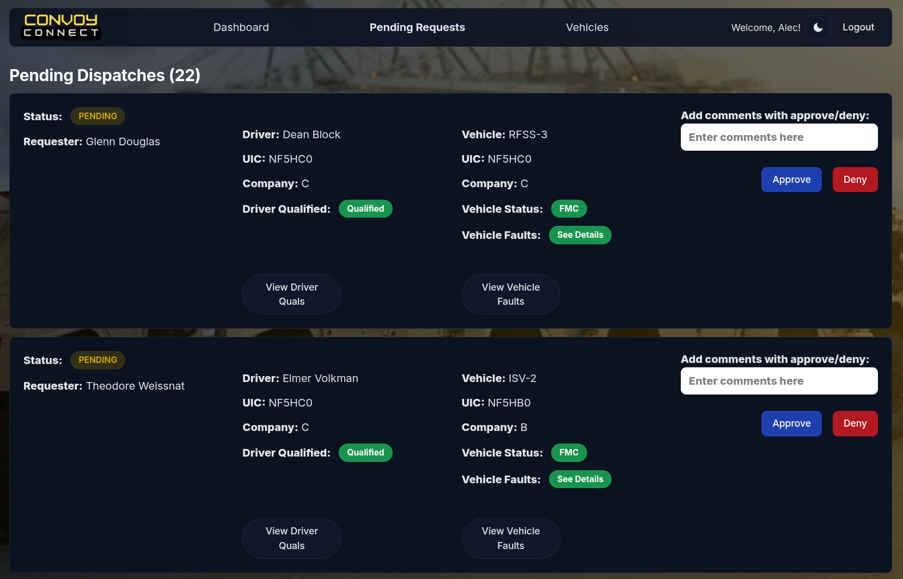
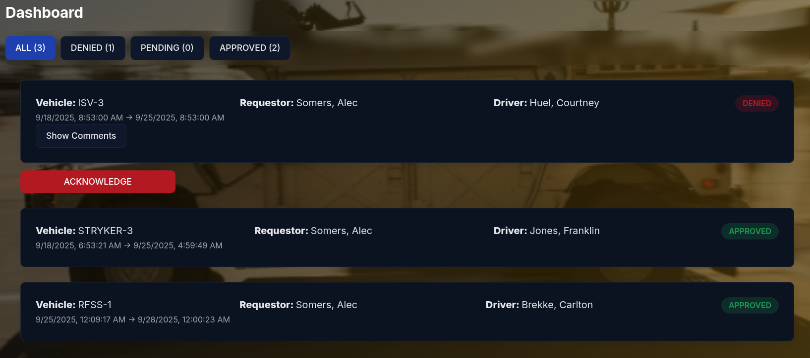
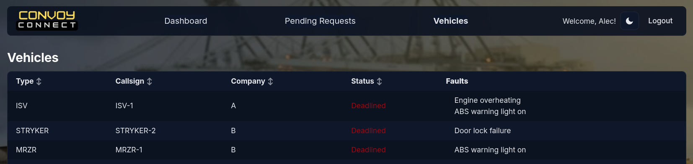

# Convoy Connect

## ***Simplifying the dispatch process***

<table>
  <tr>
    <td></td>
    <td></td>
  </tr>
  <tr>
    <td></td>
    <td></td>
  </tr>
</table>

## Quick Start (Frontend ↔ Backend)

- Backend: runs Express on `http://localhost:8080` with Postgres. Use `backend/docker-compose-dev/docker-compose.yaml` to start DB + API in dev.
- Frontend: set the API base URL in Vite env.

Frontend env (create `Frontend/.env.local`):

```
VITE_API_URL=http://localhost:8080
# Set to `cookie` only if your backend uses cookie sessions
VITE_AUTH_MODE=none
```

Notes:
- No auth routes are wired yet; development uses a local dev user.
- CORS: credentials are only sent when `VITE_AUTH_MODE=cookie`.

## Frontend docs

See [Frontend/README.md](Frontend/README.md) for detailed frontend documentation: UX and role flows, architecture, setup, and conventions for contributing.

## Backend docs

See [backend/BACKEND.md](backend/BACKEND.md) for detailed information on the Postgres schema and seed data.