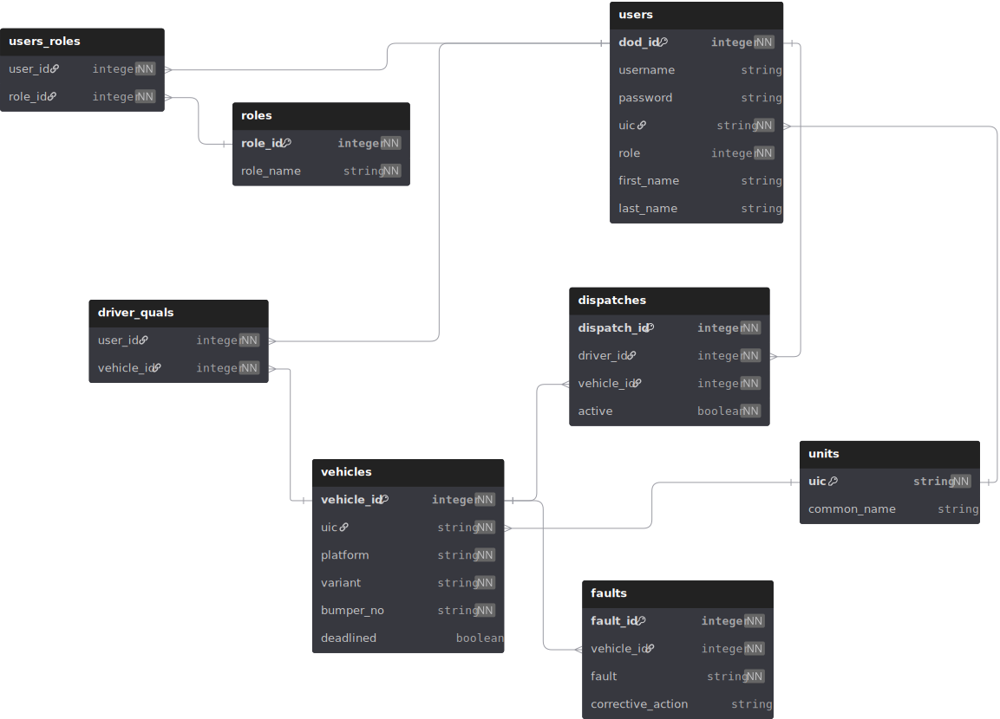

# Backend

## Running a development environment:

1. Cd into the backend/api directory and install dependencies:

```
cd backend/api && npm install
```

2. Cd into the docker-compose-dev directory

```
cd ../docker-compose-dev
```

3. Bring up development containers

```
docker compose up -d
```

## ERD
